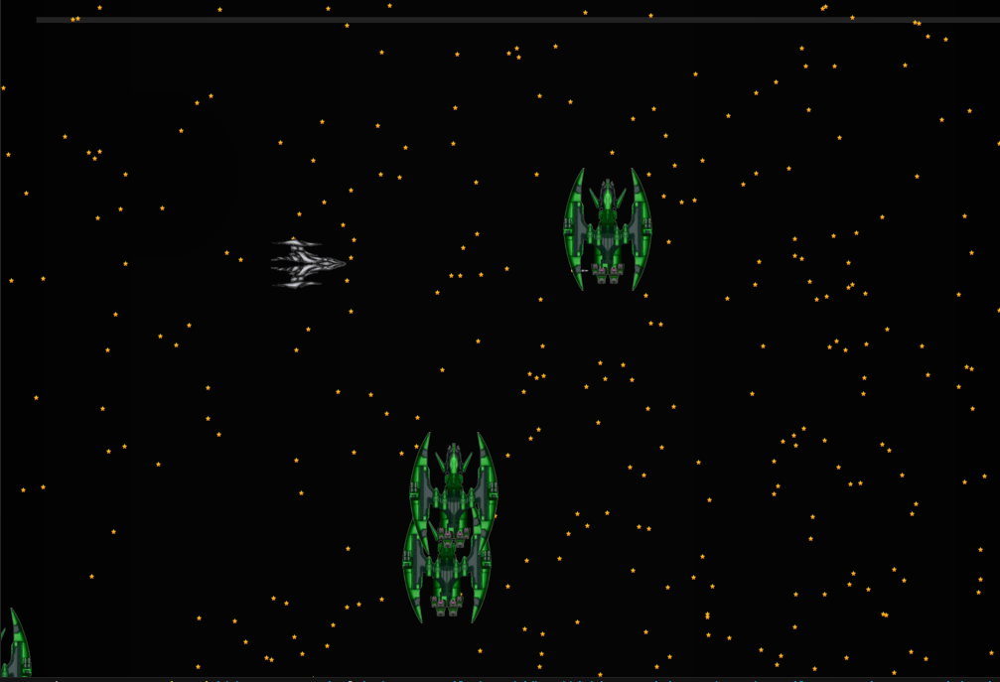

# Projeto em Java - Criando um Jogo 2D

## Nesse projeto foi utilizado POO
#### Abstração
Estrutura Clara: As classes são estruturadas de maneira a representar conceitos do mundo real, como Player, Enemy1, Stars, etc. Isso torna o design mais compreensível e modular.

#### Interação Entre Objetos
Métodos de Colisão: A interação entre diferentes objetos do jogo, como a verificação de colisões entre o Player e Enemy1, demonstra como objetos diferentes interagem uns com os outros.

